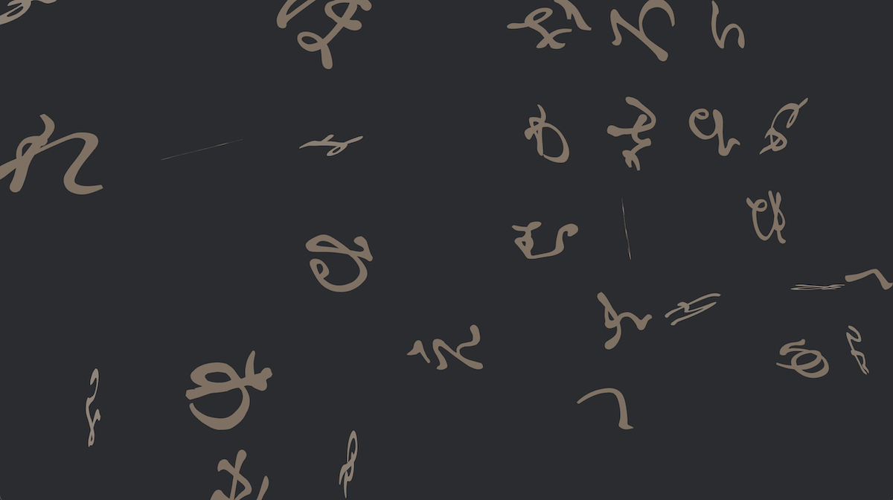

study artwork "iroha_01" / bevy 0.15



## Interactive Demo

https://funatsufumiya.github.io/iroha_01/

(Wait patiently for the first time.)

## Run (locally)

```bash
$ cargo run
```

## Build WASM

```bash
$ cargo build --release --target wasm32-unknown-unknown
$ wasm-bindgen --target web --out-dir . --no-typescript target/wasm32-unknown-unknown/release/iroha_01.wasm
```

## License

This artwork is licensed under [CC-BY-SA 4.0](https://creativecommons.org/licenses/by-sa/4.0/).

( Exception: The reason I am publishing the code here on GitHub is to make it easier to read the code of the artwork and to help other creators. It's welcome to cite or copy some (or more) lines of code as you like, when you create another artwork or article from my code, without any worry about license. But this exception cannot be applied for cloning or fork. )

Copyright (C) 2025 Fumiya Funatsu
